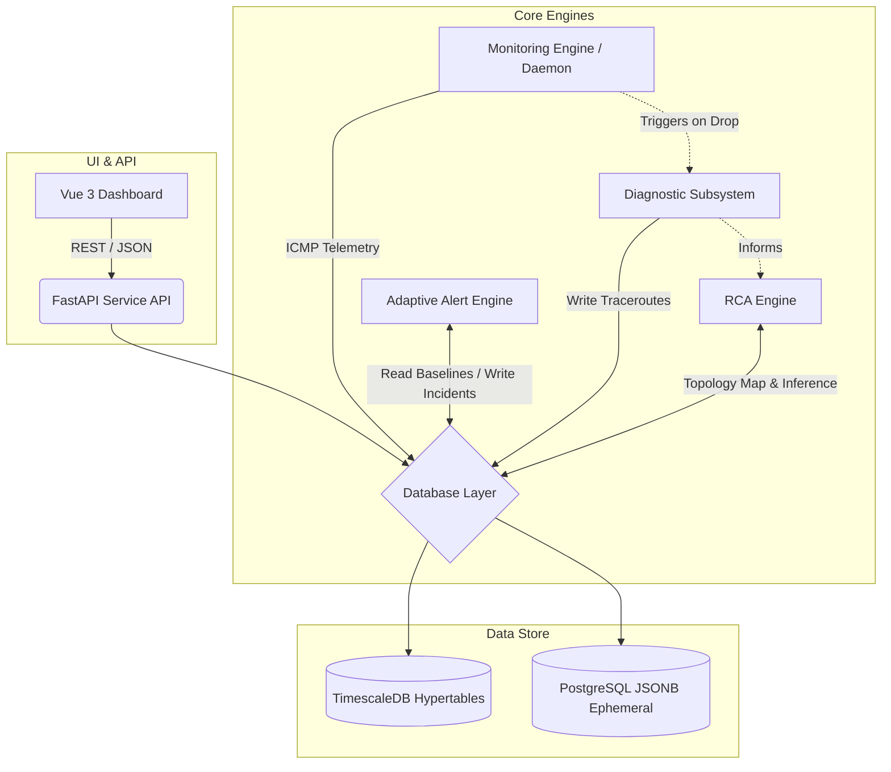

# LNMP Architecture Overview

The Network Monitoring Platform (LNMP) v1.5 is designed with a decoupled, modular architecture to guarantee continuous telemetry collection, accurate problem isolation, and resilient performance under network distress.

## Core Components

### 1. Monitoring Engine (The Poller)
The foundational element of LNMP is the Monitoring Engine. This is a persistent Python daemon, designed to run in the background via `systemd`. 
- **Concurrency Model:** Uses native Python `asyncio` to perform high-density ICMP telemetry scans.
- **Precision:** Execution is aligned precisely to absolute minute boundaries, ensuring standard intervals across all targeted endpoints.

### 2. Hybrid Adaptive Alert Engine (Baseline & Z-Score)
Rather than relying on static thresholds (e.g., "Alert if latency > 50ms"), LNMP utilizes an adaptive approach.
- **In-Memory State Machine:** Suppresses transient jitter and minor anomalies to prevent alert fatigue.
- **Statistical Baselines:** Tracks historical time-series bounds.
- **Z-Score Evaluation:** It calculates a Z-Score ($Z = \frac{x - \mu}{\sigma}$) on live latency against historical aggregates. An alert is triggered only when $Z > 3.0$, indicating a true statistical deviation from standard time-of-day traffic patterns.

### 3. Diagnostic & Traceroute Subsystem
This subsystem performs immediate path diagnostics during outages.
- **Trigger:** Initiated on the first detected drop sub-cycle of any endpoint.
- **Concurrency & Protection:** Operates asynchronously in the background. To prevent CPU or network storms, executions are tightly throttled using an `asyncio.Semaphore` queue.
- **Goal:** Capture the exact network path state at the microsecond of failure, before network routing protocols (like OSPF or BGP) can reconverge.

### 4. Topology & Root Cause Analysis (RCA) Engine
A vital component for reducing alert noise and isolating failures to the correct transit node.
- **Discovery Pipeline:** Runs sequentially during device onboarding and during scheduled midnight passes. It builds a hierarchical parent-child adjacency map.
- **Topological Inference:** If a transit router fails, all monitored downstream children will become unreachable. The RCA engine detects this pattern: if 100% of downstream children fail, the system infers an intermediate transit failure (`INFERRED_DOWN`).
- **Alert Suppression:** By pinpointing the transit failure, LNMP suppresses cascading alert noise for all downstream devices.

### 5. Telemetry & Diagnostic Datastore
The platform uses a hybrid, optimized database schema on PostgreSQL 14+.
- **TimescaleDB:** Handles high-frequency numeric metrics. Employs hypertables and continuous aggregates to keep queries lightning-fast across millions of telemetry rows.
- **JSONB Ephemeral Storage:** Standard PostgreSQL JSONB tables are used for complex, nested diagnostic traceroute data, with automated 14-day retention cleanups to prevent database bloat.

### 6. Service API & Dashboard UI
- **Service API:** Built on FastAPI, this layer serves historical logs, real-time node adjacency graphs, and handles endpoint governance. It supports granular Role-Based Access Control (RBAC).
- **Dashboard UI:** A Vue 3 (Vite) application styled with PrimeVue. It utilizes `vis-network` for interactive topology maps, employing physics stabilization to prevent visual canvas jitter.

## Architectural Diagram

## Data Flow & Processing Lifecycle

1. **Discovery:** Endpoints are added via the API. The background discovery engine identifies L2/L3 boundaries and maps hops to build the topology.
2. **Polling:** The Monitoring Engine pings the endpoints synchronously on the minute boundary.
3. **Evaluation:** Results are processed. The Adaptive Alert Engine calculates the Z-Score based on TimescaleDB continuous aggregates.
4. **Diagnostic Intervention:** If a failure is detected, the Diagnostic Subsystem fires an asynchronous traceroute.
5. **RCA Inference:** The RCA Engine evaluates the failure against the topology map to determine if it is a local failure or an inferred upstream transit failure.
6. **Storage:** Metrics are committed to TimescaleDB; diagnostic JSON is written to standard PostgreSQL tables.
