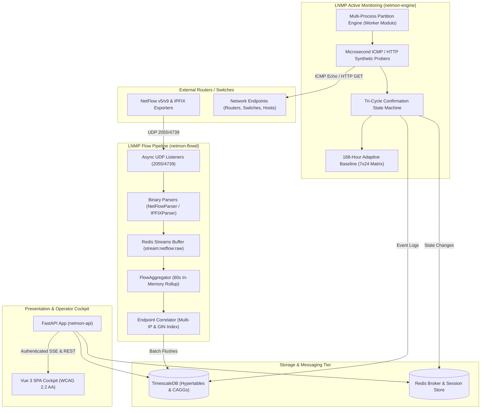

# LNMP v3.2.0 Hybrid Active/Passive Architecture Guide

## 1. Architectural Philosophy

LNMP v3.2.0 introduces a **hybrid active/passive network telemetry model**. Traditional network management platforms rely exclusively on either synthetic polling (ICMP ping, HTTP checks, SNMP polling) or passive flow collection (NetFlow, IPFIX, sFlow). LNMP bridges these two paradigms into a single unified telemetry engine.



---

## 2. Ingestion & In-Memory Pipeline

### 2.1 The Two-Tier Flow Pipeline
1. **Collector (`netmon-flowd`)**:
   - Listens on UDP ports `2055` (NetFlow v5/v9) and `4739` (IPFIX).
   - Validates headers and writes raw packet buffers directly into `stream:netflow:raw`.
   - Isolates network socket I/O from database flush latency.
2. **Aggregator (`FlowAggregator`)**:
   - Consumes from `stream:netflow:raw` using Redis consumer groups.
   - Correlates exporter source IPs against `endpoints.flow_exporter_ips` using PostgreSQL GIN indexing.
   - Buckets flows into 1-minute rollup keys: `(bucket, exporter_id, src_ip, dst_ip, protocol, dst_port)`.
   - Flushes accumulated rollups to `flow_minute_rollups` every 60 seconds using atomic multi-row `INSERT ... ON CONFLICT DO UPDATE`.

---

## 3. Storage Hierarchy & TimescaleDB Hypertables

Telemetry data is organized across four distinct retention tiers:

| Table / View | Description | Chunk Interval | Compression Policy | Retention Policy |
| :--- | :--- | :--- | :--- | :--- |
| `endpoint_events` | Synthetic probe state transitions & latency | 1 day | Compressed after 7 days | **730 days (2 years)** |
| `flow_minute_rollups` | 1-minute 5-tuple flow aggregations | 1 day | Compressed after 1 day | **90 days** |
| `flow_hourly_rollups` | Continuous aggregate hourly rollup | N/A (CAGG) | Managed by TimescaleDB | **30 days** |
| `flow_daily_rollups` | Continuous aggregate daily rollup | N/A (CAGG) | Managed by TimescaleDB | **365 days (1 year)** |

---

## 4. Multi-Process Horizontal Scalability

Active endpoint monitoring can be partitioned across an arbitrary number of background processes using deterministic UUID hashing:

```python
worker_id = int(os.environ.get("NETMON_ENGINE_WORKER_ID", "0"))
num_workers = int(os.environ.get("NETMON_ENGINE_NUM_WORKERS", "1"))

if num_workers > 1:
    assigned_endpoints = [
        ep for ep in active_endpoints
        if (int.from_bytes(ep.id.bytes[:4], "big") % num_workers) == worker_id
    ]
```

This guarantees:
1. Zero duplicate polling or race conditions between worker daemons.
2. Even load distribution across multi-core systems.
3. Linear horizontal scalability up to 10,000+ endpoints.
