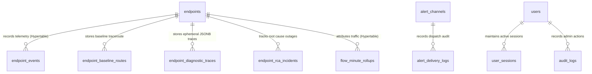

# LNMP Database & TimescaleDB Architecture — Version 3.3.0

This document details the PostgreSQL 14+ schema design, TimescaleDB hypertable partitioning, continuous aggregates, columnar compression policies, and 4-tier lifecycle in LNMP v3.3.0.

---

## 1. Relational Schema Architecture



---

## 2. Table Specifications

### `endpoints`
Stores network monitoring targets, IP addresses, operational flags, and multi-IP flow exporter mappings.
* `id` (`UUID`, Primary Key)
* `hostname` (`VARCHAR(255)`, Not Null)
* `ip_address` (`INET`, Unique, Not Null)
* `device_type` (`VARCHAR(50)`: `ENDPOINT`, `TRANSIT_ROUTER`, `L2_SEGMENT`, `FIREWALL`, `SWITCH`)
* `location` / `site` (`VARCHAR(255)`)
* `allow_incident_trace` (`BOOLEAN`, Default: `true`)
* `allow_topology_discovery` (`BOOLEAN`, Default: `true`)
* `manual_parent_id` (`UUID`, Foreign Key to `endpoints.id`, Nullable)
* `flow_exporter_ips` (`INET[]`, Default: `'{}'::inet[]`, Not Null) — Secondary exporter IP addresses aliased to this endpoint. Indexed via GIN index `idx_endpoints_flow_exporter_ips` for high-speed array containment queries (`flow_exporter_ips @> ARRAY['192.168.1.1'::inet]`).
* `flow_interface_aliases` (`JSONB`, Default: `'{}'::jsonb`, Not Null) — Key-value dictionary mapping SNMP interface indexes (`ifIndex`) to human-readable labels and operational speeds (e.g. `{"1": {"name": "WAN-Fiber", "speed_mbps": 1000}}`).

### `endpoint_events` (TimescaleDB Hypertable)
Stores high-frequency 1-minute ICMP and synthetic probe telemetry results.
* `id` (`UUID`, Default: `gen_random_uuid()`)
* `endpoint_id` (`UUID`, Indexed, Foreign Key to `endpoints.id`)
* `start_time` (`TIMESTAMPTZ`, Partition Key, Not Null)
* `operational_state` (`VARCHAR(20)`: `UP`, `DOWN`)
* `detailed_state` (`VARCHAR(30)`: `UP`, `UP-UNSTABLE`, `DOWN-UNSTABLE`, `DOWN`)
* `packet_loss_percent` (`NUMERIC(5, 2)`)
* `avg_rtt_ms` (`NUMERIC(10, 3)`)
* `min_rtt_ms` (`NUMERIC(10, 3)`)
* `max_rtt_ms` (`NUMERIC(10, 3)`)

### `flow_minute_rollups` (TimescaleDB Hypertable)
Stores 1-minute aggregated passive flow metrics ingested via NetFlow v5, NetFlow v9, and IPFIX.
* `bucket` (`TIMESTAMPTZ`, Primary Key, Partition Key, Not Null) — 1-minute time boundary.
* `exporter_id` (`UUID`, Primary Key, Not Null) — Associated endpoint UUID (`00000000-0000-0000-0000-000000000000` for unmapped/orphan flows).
* `src_endpoint_id` (`UUID`, Nullable) — UUID of the source endpoint if matched in inventory.
* `dst_endpoint_id` (`UUID`, Nullable) — UUID of the destination endpoint if matched in inventory.
* `src_ip` (`INET`, Primary Key, Not Null) — Flow source IP address.
* `dst_ip` (`INET`, Primary Key, Not Null) — Flow destination IP address.
* `protocol` (`SMALLINT`, Primary Key, Not Null) — IANA IP protocol number (e.g. 6 = TCP, 17 = UDP, 1 = ICMP).
* `dst_port` (`INTEGER`, Primary Key, Not Null) — Destination port normalized to prevent unbounded index cardinality.
* `bytes` (`BIGINT`, Default: 0, Not Null) — Total bytes transferred in the 1-minute window.
* `packets` (`BIGINT`, Default: 0, Not Null) — Total packets transferred.
* `flow_count` (`INTEGER`, Default: 1, Not Null) — Number of discrete flow records aggregated into this rollup.
* *Indexes*:
  - `idx_flow_minute_src_dst_endpoint` (`bucket`, `src_endpoint_id`, `dst_endpoint_id`)
  - `idx_flow_minute_exporter_bucket` (`exporter_id`, `bucket`)

### `alert_channels`
Stores notification destinations and credentials with AES-256-GCM encryption.
* `id` (`UUID`, Primary Key)
* `name` (`VARCHAR(100)`, Not Null)
* `channel_type` (`VARCHAR(50)`: `TEAMS`, `DISCORD`, `SLACK`, `EMAIL`, `WEBHOOK`)
* `destination` (`VARCHAR(1024)`, Not Null) — Target URL or email address.
* `is_enabled` (`BOOLEAN`, Default: `true`)
* `target_scope` (`VARCHAR(20)`: `all`, `custom`)
* `endpoint_ids` (`UUID[]`, Default: `'{}'`)
* `severities` (`VARCHAR(20)[]`, Default: `'{DOWN,DOWN-UNSTABLE}'`)
* `encrypted_secret` (`TEXT`, Nullable) — AES-256-GCM encrypted webhook token or SMTP credentials.
* `created_at` (`TIMESTAMPTZ`, Default: `now()`)
* `updated_at` (`TIMESTAMPTZ`, Default: `now()`)

### `alert_delivery_logs`
Audit log of all outbound dispatch attempts.
* `id` (`UUID`, Primary Key)
* `channel_id` (`UUID`, Foreign Key to `alert_channels.id`, Nullable)
* `event_type` (`VARCHAR(50)`, Not Null)
* `endpoint_id` (`UUID`, Nullable)
* `status` (`VARCHAR(20)`: `DELIVERED`, `FAILED`, `SUPPRESSED`)
* `response_code` (`INTEGER`, Nullable)
* `latency_ms` (`NUMERIC(8, 2)`, Nullable)
* `error_message` (`TEXT`, Nullable)
* `created_at` (`TIMESTAMPTZ`, Default: `now()`)

---

## 3. 4-Tier Hierarchical Storage Lifecycle

To deliver real-time sub-second forensic drill-down while keeping long-term disk growth bounded, flow telemetry is stored across 4 tiered stages:

| Tier | Storage Engine | Retention | Granularity | Compression / Aggregation | Use Case |
| :--- | :--- | :--- | :--- | :--- | :--- |
| **Tier 1** | Redis Stream (`stream:netflow:raw`) | 2 Hours | Flow Record | Sliding `MAXLEN ~100000`, in-memory buffer | Real-time forensic packet/flow inspection, live anomaly triage. |
| **Tier 2** | TimescaleDB Hypertable (`flow_minute_rollups`) | 7 Days | 1 Minute | Uncompressed for 24h, native columnar compression after 1 day (85%+ disk savings) | Short-term forensic queries, detailed talker attribution, conversation drill-downs. |
| **Tier 3** | TimescaleDB Continuous Aggregate (`flow_hourly_rollups`) | 30 Days | 1 Hour | Materialized View with auto-refresh policy (`start_offset: 3d`, `end_offset: 1h`) | Weekly / monthly capacity trends, application mix shifts, bandwidth forecasting. |
| **Tier 4** | TimescaleDB Continuous Aggregate (`flow_daily_rollups`) | 365 Days | 1 Day | Materialized View with auto-refresh policy (`start_offset: 7d`, `end_offset: 1d`) | Annual capacity planning, ISP billing auditing, executive reporting. |

---

## 4. TimescaleDB Columnar Compression & Retention Policies

### A. Telemetry Events Compression (7-Day Policy)
```sql
ALTER TABLE endpoint_events SET (
    timescaledb.compress,
    timescaledb.compress_segmentby = 'endpoint_id',
    timescaledb.compress_orderby = 'start_time DESC'
);

SELECT add_compression_policy('endpoint_events', INTERVAL '7 days', if_not_exists => true);
SELECT add_retention_policy('endpoint_events', INTERVAL '90 days', if_not_exists => true);
```

### B. Flow Minute Rollups Compression & Retention
`flow_minute_rollups` is chunked in 1-day intervals. After 1 day, chunks are converted to TimescaleDB's hybrid columnar format, yielding over **85% disk space savings**:
```sql
-- Convert to hypertable with 1-day chunk interval
SELECT create_hypertable(
    'flow_minute_rollups',
    'bucket',
    chunk_time_interval => INTERVAL '1 day',
    if_not_exists => TRUE
);

-- Columnar compression segmenting by exporter, protocol, and port
ALTER TABLE flow_minute_rollups SET (
    timescaledb.compress,
    timescaledb.compress_segmentby = 'exporter_id, protocol, dst_port',
    timescaledb.compress_orderby = 'bucket DESC'
);

-- Compress chunks older than 24 hours
SELECT add_compression_policy('flow_minute_rollups', INTERVAL '1 day', if_not_exists => TRUE);

-- Automatically purge raw minute rollups after 7 days
SELECT add_retention_policy('flow_minute_rollups', INTERVAL '7 days', if_not_exists => TRUE);
```

---

## 5. Continuous Aggregates & Baseline Repair

### Hourly Flow Continuous Aggregate (`flow_hourly_rollups`)
Pre-aggregates 60 1-minute samples into 1-hour windows:
```sql
CREATE MATERIALIZED VIEW flow_hourly_rollups
WITH (timescaledb.continuous) AS
SELECT
    time_bucket('1 hour', bucket) AS bucket,
    exporter_id,
    src_endpoint_id,
    dst_endpoint_id,
    protocol,
    dst_port,
    SUM(bytes)::BIGINT AS bytes,
    SUM(packets)::BIGINT AS packets,
    SUM(flow_count)::INTEGER AS flow_count
FROM flow_minute_rollups
GROUP BY time_bucket('1 hour', bucket), exporter_id, src_endpoint_id, dst_endpoint_id, protocol, dst_port
WITH NO DATA;

SELECT add_continuous_aggregate_policy(
    'flow_hourly_rollups',
    start_offset => INTERVAL '3 days',
    end_offset => INTERVAL '1 hour',
    schedule_interval => INTERVAL '1 hour',
    if_not_exists => TRUE
);

SELECT add_retention_policy('flow_hourly_rollups', INTERVAL '30 days', if_not_exists => TRUE);
```

### Daily Flow Continuous Aggregate (`flow_daily_rollups`)
Rolls up traffic into daily totals by exporter, protocol, and service port:
```sql
CREATE MATERIALIZED VIEW flow_daily_rollups
WITH (timescaledb.continuous) AS
SELECT
    time_bucket('1 day', bucket) AS bucket,
    exporter_id,
    protocol,
    dst_port,
    SUM(bytes)::BIGINT AS bytes,
    SUM(packets)::BIGINT AS packets,
    SUM(flow_count)::INTEGER AS flow_count
FROM flow_minute_rollups
GROUP BY time_bucket('1 day', bucket), exporter_id, protocol, dst_port
WITH NO DATA;

SELECT add_continuous_aggregate_policy(
    'flow_daily_rollups',
    start_offset => INTERVAL '7 days',
    end_offset => INTERVAL '1 day',
    schedule_interval => INTERVAL '1 day',
    if_not_exists => TRUE
);

SELECT add_retention_policy('flow_daily_rollups', INTERVAL '365 days', if_not_exists => TRUE);
```

### Historical Baseline View Repair (`node_historical_baselines`)
TimescaleDB continuous aggregates require grouping by `time_bucket()` on the partition column and disallow non-monotonic expressions such as `EXTRACT(dow FROM start_time)`. 

To maintain the 168-hour weekly statistical profile without violating continuous aggregate invariants or causing migration failures, `node_historical_baselines` is defined as a robust standard view (or refreshed materialized view):

```sql
CREATE VIEW node_historical_baselines AS
SELECT
    endpoint_id,
    EXTRACT(dow FROM start_time)::INTEGER AS day_of_week,
    EXTRACT(hour FROM start_time)::INTEGER AS hour_of_day,
    AVG(avg_rtt_ms)::FLOAT AS historical_mean,
    STDDEV(avg_rtt_ms)::FLOAT AS historical_stddev
FROM endpoint_events
WHERE avg_rtt_ms IS NOT NULL
GROUP BY endpoint_id, EXTRACT(dow FROM start_time), EXTRACT(hour FROM start_time);
```
This guarantees that Z-score anomaly detection functions correctly across all deployment environments (whether running vanilla PostgreSQL or TimescaleDB).
