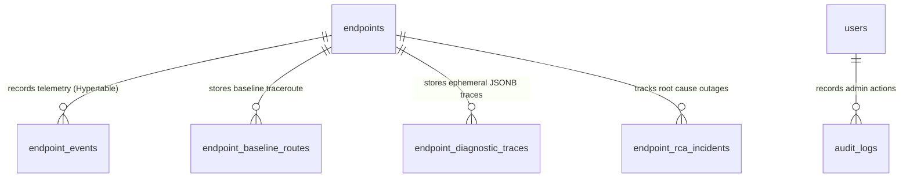

# LNMP Database & TimescaleDB Architecture

This document details the PostgreSQL 14+ schema design, TimescaleDB hypertable partitioning, continuous aggregates, and compression policies in LNMP v2.0 (Beta).

---

## 1. Relational Schema Architecture



---

## 2. Table Specifications

### `endpoints`
Stores network monitoring targets, IP addresses, and operational flags.
* `id` (UUID, Primary Key)
* `hostname` (VARCHAR)
* `ip_address` (INET)
* `device_type` (VARCHAR: `ENDPOINT`, `TRANSIT_ROUTER`, `L2_SEGMENT`, etc.)
* `location` / `site` (VARCHAR)
* `allow_incident_trace` (BOOLEAN, default: `true`)
* `allow_topology_discovery` (BOOLEAN, default: `true`)
* `manual_parent_id` (UUID, Foreign Key to `endpoints.id`)

### `endpoint_events` (TimescaleDB Hypertable)
Stores high-frequency 1-minute telemetry poll results.
* `id` (UUID)
* `endpoint_id` (UUID, Indexed)
* `start_time` (TIMESTAMPTZ, Partition Column)
* `operational_state` (VARCHAR: `UP`, `DOWN`)
* `detailed_state` (VARCHAR: `UP`, `UP-UNSTABLE`, `DOWN-UNSTABLE`, `DOWN`)
* `packet_loss_percent` (NUMERIC)
* `avg_rtt_ms` (NUMERIC)
* `min_rtt_ms` (NUMERIC)
* `max_rtt_ms` (NUMERIC)

### `node_historical_baselines` (Continuous Aggregate Materialized View)
Precomputes hourly baseline distributions across 168 weekly bins (7 days × 24 hours).
* `endpoint_id` (UUID)
* `day_of_week` (INTEGER, 0–6)
* `hour_of_day` (INTEGER, 0–23)
* `historical_mean` (NUMERIC)
* `historical_stddev` (NUMERIC)
* `sample_count` (BIGINT)

### `endpoint_diagnostic_traces` (Ephemeral JSONB)
Stores complex hop-by-hop traceroute snapshots captured during outages.
* `id` (UUID, Primary Key)
* `endpoint_id` (UUID)
* `timestamp` (TIMESTAMPTZ)
* `trace_data` (JSONB: array of hop objects)
* *Retention*: Automatically purged after 14 days by background cleaner.

### `endpoint_rca_incidents`
Tracks root cause incidents and upstream failure points.
* `id` (UUID, Primary Key)
* `endpoint_id` (UUID)
* `failed_hop_ip` (VARCHAR)
* `rca_summary` (TEXT)
* `is_resolved` (BOOLEAN)
* `created_at` (TIMESTAMPTZ)
* *Retention*: Automatically purged after 90 days if resolved.

---

## 3. TimescaleDB 7-Day Chunk Compression

To sustain years of continuous monitoring without unconstrained disk growth, native hypertable columnar compression is active:

```sql
-- Compression Configuration (from migration 0005_v2_0_timescale_stability.py)
ALTER TABLE endpoint_events SET (
    timescaledb.compress,
    timescaledb.compress_segmentby = 'endpoint_id',
    timescaledb.compress_orderby = 'start_time DESC'
);

-- Automated 7-Day Compression Policy
SELECT add_compression_policy('endpoint_events', INTERVAL '7 days', if_not_exists => true);
```

### Operational Impact:
* **Compression Ratio**: Over 90%+ storage reduction on historical chunks.
* **Query Transparency**: Fully queryable by PostgreSQL `SELECT` queries without manual decompression.

---

## 4. Continuous Aggregate Auto-Refresh Policy

```sql
-- Auto-refresh continuous aggregate hourly
SELECT add_continuous_aggregate_policy(
    'node_historical_baselines',
    start_offset => INTERVAL '30 days',
    end_offset => INTERVAL '1 hour',
    schedule_interval => INTERVAL '1 hour',
    if_not_exists => true
);
```
Guarantees fast statistical Z-score lookups with zero manual aggregation overhead.
