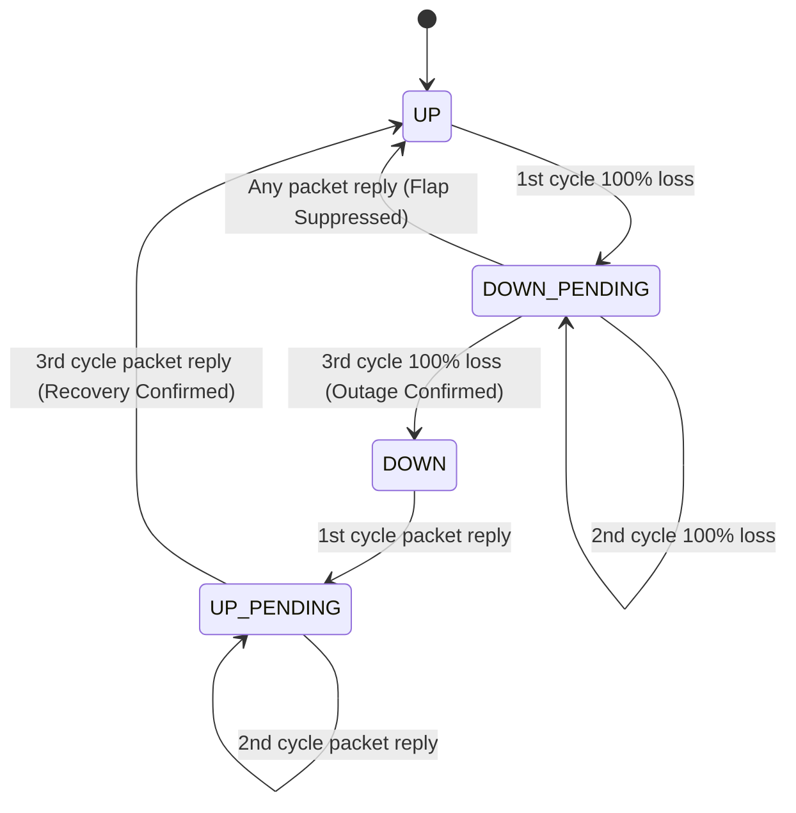

# LNMP SLA Calculation & Availability Methodology

This document outlines the mathematical principles, state machine transitions, and outage neutralization formulas used by LNMP to calculate Service Level Agreement (SLA) uptime.

---

## 1. High-Density 10-Ping Sub-Cycle Polling

Within every 60-second window aligned to the absolute minute mark, the LNMP monitoring daemon sends:
* **10 ICMP echo requests** spaced 6 seconds apart (`Interval = 6.0s`).
* **Packet Loss & Latency Metrics**:
  - `failed_count` (`0 <= k <= 10`)
  - `packet_loss_percent` = `(k / 10) * 100%`
  - `avg_rtt_ms`, `min_rtt_ms`, `max_rtt_ms` (calculated across successful pings).

---

## 2. Dual-State Health Engine

To prevent momentary packet jitter from skewing SLA uptime, LNMP separates operational state from detailed packet health:

```
[Packet Health / Detailed State]
  - UP              (0 packet drops, normal RTT)
  - UP-UNSTABLE     (1 to 4 packet drops or high jitter)
  - DOWN-UNSTABLE   (5 to 9 packet drops)
  - DOWN            (10 packet drops / 100% loss)

[Production Availability / Operational State]
  - UP              (Endpoint is operational; contributes to uptime)
  - DOWN            (Endpoint is unavailable; counts as SLA outage)
```

---

## 3. In-Memory Flap Suppression (N=3)

State transitions require **3 consecutive cycles (180 seconds)** of sustained condition before the operational state switches from `UP` to `DOWN` or `DOWN` to `UP`:



---

## 4. Honest SLA Mathematics & Blackout Neutralization

### The Problem with Traditional SLA Calculators
If the monitoring server itself loses power or undergoes scheduled maintenance, traditional monitoring tools record the missing intervals as "outages" for all monitored clients, skewing SLA reports.

### The LNMP Blackout Neutralization Formula
LNMP computes availability exclusively over monitored lifetime intervals:

```
SLA Availability (%) = [ T_online / (T_monitored_lifetime - T_blackout_neutralized) ] * 100
```

Where:
* `T_online`: Cumulative minutes where `operational_state = 'UP'`.
* `T_monitored_lifetime`: Total elapsed minutes since the endpoint was onboarded.
* `T_blackout_neutralized`: Server downtime or excluded maintenance periods during which the monitoring engine was offline.

This guarantees mathematically sound SLA compliance reports for client reporting, audits, and executive reviews.
